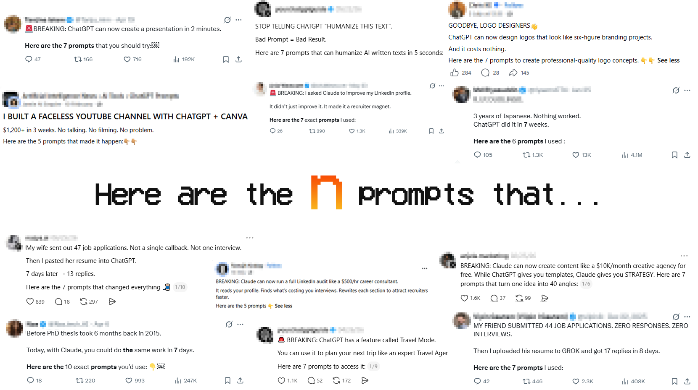

<p align="center">
  
</p>

<div align="center">

**Your favorite prompt marketing posts now come in pack.**

[Browse the roster](CATALOG.md) · [Browse source files](collections/) · [Contribute a prompt pack](CONTRIBUTING.md) · [Read the data policy](DATA_POLICY.md)

</div>

<p align="center">
  <a href="https://github.com/zfoong/Here-are-the-N-prompts-that/stargazers"></a>
  
  
  
  <a href="LICENSE"></a>
</p>

# Here are the N prompts that...

> I made $500/hour, found 3 jobs, marry 2 hubands and 3 wives using ChatGPT. You will not believe how easy it is.
>
> Here are the 7 prompts that I used to make these happen 👇.

Social media is full of posts claiming someone made `$10K in 30 days`, replaced an entire department, or unlocked a suspiciously complete business...all with **N prompts** conveniently buried in the comment section.

This repository collects those posts, preserves the prompt wording that actually circulated, and keeps the original source attached. No “comment **PROMPT** and follow me so I can DM you” required.

If that sounds useful or at least cathartic, star the repo.

## ⚡ Use a prompt in 30 seconds

1. Pick a category from the roster below.
2. Open a prompt pack and copy what you need.
3. Replace every `[BRACKETED_VARIABLE]` with your own context.

## What each pack page contains

Every sourced post gets one short page:

```text
Title    Here are the 5 prompts...
Category Solopreneur
Prompts  Verified wording from the public source
Source   Original public post and author
```

<!-- collection-roster:start -->
## 🎭 The prompt-pack roster

Find the pack you like and just copy the prompts. You can also tell your favorite AI agent to find and execute prompts from here.

<a id="money-making"></a>

### 💸 Money Making

Side hustles, digital products, monetization, and plots involving suspiciously passive income.

| Prompt pack | What's inside | Prompts |
| --- | --- | ---: |
| [Here are the 10 prompts that made me my first $1k online](collections/money-making/hnp-001-here-are-the-10-prompts-that-made-me-my-first-1k-online.md) | Niche problem extractor · Product idea validator · Product title generator · +7 more | 10 |
| [I changed how I ask ChatGPT for side hustle ideas. Here are 7 prompts that actually work.](collections/money-making/hnp-002-i-changed-how-i-ask-chatgpt-for-side-hustle-ideas-here-are-7-prompts-tha.md) | Side-hustle discovery · Market validation · Hidden niche finder · +4 more | 7 |
| [If I lost everything, I'd start a faceless YouTube channel. These 7 prompts provide the blueprint.](collections/money-making/hnp-025-if-i-lost-everything-i-d-start-a-faceless-youtube-channel-these-7-prompt.md) | Niche shortlist · Audience-question research · Short video script · +4 more | 7 |
| [7 ChatGPT prompts that can actually make you money](collections/money-making/hnp-032-7-chatgpt-prompts-that-can-actually-make-you-money.md) | Freelance Blog Writer · Product Research Assistant · Ebook Creator · +4 more | 7 |
| [6 Prompts That Made My Side Hustle Finally Click!](collections/money-making/hnp-040-6-prompts-that-made-my-side-hustle-finally-click.md) | The Side Hustle Blueprint · The Offer Shaper · The Content Machine · +3 more | 6 |
| [10 Money-Making AI Prompts (With Frameworks That Actually Work)](collections/money-making/hnp-044-10-money-making-ai-prompts-with-frameworks.md) | Prompt 1 · Prompt 2 · Prompt 3 · +7 more | 10 |
| [No passive income ideas? Use these 9 prompts to find ideas that can turn into passive income](collections/money-making/hnp-049-9-prompts-to-find-viable-passive-income-ideas.md) | Prompt 1 · Prompt 2 · Prompt 3 · +6 more | 9 |
| [I had zero audience, zero experience. These 5 prompts helped me build and launch my first digital product.](collections/money-making/hnp-063-5-prompts-to-build-and-launch-a-digital-product.md) | The Idea Validator · The Outline Builder · The Anti-Fluff Writer · +2 more | 5 |
| [7 Claude Prompts to Build and Sell Your Digital Product on Instagram (Complete Toolkit)](collections/money-making/hnp-064-7-claude-prompts-to-build-and-sell-a-digital-product.md) | The Digital Product Idea Generator · The Product Outline Builder · The Instagram Bio Converter · +4 more | 7 |
| [10 useful ChatGPT prompts for generating online business ideas](collections/money-making/hnp-072-10-chatgpt-prompts-for-online-business-ideas.md) | Online business idea prompt 1 · Online business idea prompt 2 · Online business idea prompt 3 · +7 more | 10 |
| [7 AI prompts for turning ideas into extra income](collections/money-making/hnp-103-7-ai-prompts-for-turning-ideas-into-extra-income.md) | Idea Clarity Map · Feasibility Checker · Low-Cost Test Plan · +4 more | 7 |
| [ChatGPT + affiliate marketing: use these 5 prompts to get started](collections/money-making/hnp-105-chatgpt-affiliate-marketing-use-these-5-prompts-to-get-started.md) | Affiliate Product Research Prompt · Authority Content Funnel · Affiliate Blog Blueprint · +2 more | 5 |
| [8 AI prompts for monetizing a Facebook page](collections/money-making/hnp-117-8-ai-prompts-for-monetizing-a-facebook-page.md) | The Affiliate Income Strategy · The Digital Product Brainstormer · The Email List Builder · +5 more | 8 |
| [7 ChatGPT prompts to create, optimize, and scale Etsy digital products](collections/money-making/hnp-131-7-chatgpt-prompts-to-create-optimize-and-scale-etsy-digital-products.md) | Digital Product Ideation Prompt · Product Creation Prompt · Listing Optimization Prompt · +4 more | 7 |
| [7 prompts to make money with YouTube](collections/money-making/hnp-132-7-prompts-to-make-money-with-youtube.md) | Viral YouTube Video Ideas · Viral YouTube Video Script · Faceless YouTube Channel Automation · +4 more | 7 |
| [I asked ChatGPT to build me a $10K/month side hustle plan: 7 prompts](collections/money-making/hnp-144-i-asked-chatgpt-to-build-me-a-10k-month-side-hustle-plan-7-prompts.md) | Skill-to-Money Mapper · Market Demand Validator · High-Value Offer Architect · +4 more | 7 |
| [Turn any idea into a digital product with these 9 prompts](collections/money-making/hnp-150-turn-any-idea-into-a-digital-product-with-these-9-prompts.md) | Idea Validation · Product Definition · Instant Roadmap · +6 more | 9 |
| [5 ChatGPT prompts to help you start a side hustle fast](collections/money-making/hnp-191-5-chatgpt-prompts-to-help-you-start-a-side-hustle-fast.md) | Find your hustle · Test before you waste money · Steal pro-level copy · +2 more | 5 |
| [10 ChatGPT Prompts to Kickstart Your Side Hustle Business](collections/money-making/hnp-197-10-chatgpt-prompts-to-kickstart-your-side-hustle-business.md) | Niche Finder · Business Plan Generator · Brand Identity Builder · +7 more | 10 |

<a id="solopreneur"></a>

### 🧑‍💼 Solopreneur

Freelancing, founders, small-business operations, products, and doing six jobs before lunch.

| Prompt pack | What's inside | Prompts |
| --- | --- | ---: |
| [Here are 5 ChatGPT prompts I use to run my small business](collections/solopreneur/hnp-006-here-are-5-chatgpt-prompts-i-use-to-run-my-small-business.md) | Overdue invoice · Negative review response · Job posting · +2 more | 5 |
| [5 ChatGPT prompts for freelancers that actually solve real problems](collections/solopreneur/hnp-008-5-chatgpt-prompts-for-freelancers-that-actually-solve-real-problems.md) | Late-invoice chase · Price objection · Ghosted mid-project · +2 more | 5 |
| [Here are 10 ChatGPT prompts that can help you start, scale, and strengthen your business](collections/solopreneur/hnp-015-here-are-10-chatgpt-prompts-that-can-help-you-start-scale-and-strengthen.md) | Lean startup test · Value proposition canvas · OKR setup · +7 more | 10 |
| [The 10 Claude Prompts Every Business Leader Needs for Unfair Leverage (Pro Tips + Hidden Use Cases)](collections/solopreneur/hnp-052-10-claude-prompts-for-business-leaders.md) | The Strategic Planning Architect · The Competitive Analysis Engine · The Executive Communication Polisher · +7 more | 10 |
| [Here are 5 ChatGPT prompts I use to run my small business faster](collections/solopreneur/hnp-066-5-chatgpt-prompts-for-running-a-small-business.md) | Overdue invoice follow-up · Negative Google review · Job posting · +2 more | 5 |
| [I compiled 500+ ChatGPT prompts for business owners — here are 10 free ones](collections/solopreneur/hnp-067-10-chatgpt-prompts-for-business-owners.md) | Business prompt 1 · Business prompt 2 · Business prompt 3 · +7 more | 10 |
| [20 AI Prompts Every Solopreneur Should Be Using (Marketing, Growth, Productivity & More)](collections/solopreneur/hnp-071-20-ai-prompts-for-solopreneurs.md) | Vision & Clarity 1 · Vision & Clarity 2 · Offer & Positioning 1 · +17 more | 20 |
| [10 ChatGPT Prompts for Founders to Scale a Business](collections/solopreneur/hnp-091-10-chatgpt-prompts-for-founders-to-scale-a-business.md) | Market Expansion Strategy Blueprint · Customer Acquisition Playbook · Pricing Model Optimization · +7 more | 10 |
| [10 High-ROI Product Management Prompts](collections/solopreneur/hnp-092-10-high-roi-product-management-prompts.md) | Strategic Product Ideation · Competitor Intelligence Analysis · Data-Driven User Stories · +7 more | 10 |
| [10 AI Prompts for Small Businesses That Actually Work](collections/solopreneur/hnp-099-10-ai-prompts-for-small-businesses.md) | Marketing · Email · Sales · +7 more | 10 |
| [From idea to plan: 5 ChatGPT prompts that build your business plan](collections/solopreneur/hnp-135-from-idea-to-plan-5-chatgpt-prompts-that-build-your-business-plan.md) | Build My Business Plan Outline · Analyze My Market and Audience · Map Out My Revenue Model · +2 more | 5 |
| [I was shocked to discover these 5 ChatGPT prompts that helped business owners scale in just a month](collections/solopreneur/hnp-159-i-was-shocked-to-discover-these-5-chatgpt-prompts-that-helped-business-owne.md) | Sales funnel builder · 30-day social media plan · Audience personas · +2 more | 5 |
| [5 AI prompts for 2026 business planning](collections/solopreneur/hnp-173-5-ai-prompts-for-2026-business-planning.md) | The 2026 Strategic Master Plan (The "All-In-One") · The Automation Ecosystem Architect · The 2026 Content & Authority Calendar · +2 more | 5 |

<a id="growth"></a>

### 📈 Growth

Followers, reach, engagement, personal brands, channels, and the algorithm's approval.

| Prompt pack | What's inside | Prompts |
| --- | --- | ---: |
| [These 5 ChatGPT prompts are helping me go viral on LinkedIn daily](collections/growth/hnp-017-these-5-chatgpt-prompts-are-helping-me-go-viral-on-linkedin-daily.md) | Viral hook generator · Audience decoder · Story-to-post translator · +2 more | 5 |
| [Here are 8 ChatGPT prompts I can literally die for as someone building a personal brand](collections/growth/hnp-019-here-are-8-chatgpt-prompts-i-can-literally-die-for-as-someone-building-a.md) | Profile audit · Content calendar · Niche and audience clarity · +5 more | 8 |
| [7 ChatGPT prompts to make your content go viral - get the best hooks, carousels, trends, competitors, and viral ideas](collections/growth/hnp-075-7-chatgpt-prompts-to-make-content-go-viral.md) | Find Viral Content Ideas · Generate Scroll-Stopping Hooks · Steal Competitor Psychology · +4 more | 7 |
| [5 powerhouse prompts to grow your Facebook](collections/growth/hnp-107-5-powerhouse-prompts-to-grow-your-facebook.md) | The Scroll-Stopping Hook Generator · The Viral Facebook Idea Generator (AI-related) · The High-Converting Lead Gen Angle Generator · +2 more | 5 |
| [7 AI prompts for viral content in your niche](collections/growth/hnp-116-7-ai-prompts-for-viral-content-in-your-niche.md) | "X to Y" Transformation Framework · Swipe File of Proven CTAs · Controversy with Class · +4 more | 7 |
| [8 powerhouse prompts to grow your Facebook page](collections/growth/hnp-118-8-powerhouse-prompts-to-grow-your-facebook-page.md) | The Scroll-Stopping Hook Generator · The Viral Facebook Idea Generator (AI-Related) · The High-Converting Lead Gen Angle Generator · +5 more | 8 |
| [10 field-tested prompts to grow a Facebook page organically](collections/growth/hnp-119-10-field-tested-prompts-to-grow-a-facebook-page-organically.md) | Audience Pain Mining Prompt · Comment-Bait Without Being Spammy · Pattern Interrupt Storytelling · +7 more | 10 |
| [Steal these 5 ChatGPT prompts for TikTok growth](collections/growth/hnp-122-steal-these-5-chatgpt-prompts-for-tiktok-growth.md) | Niche Growth Plan · Trending Content Finder · Viral Script Generator · +2 more | 5 |
| [8 AI prompts for reputation-building YouTube Shorts](collections/growth/hnp-126-8-ai-prompts-for-reputation-building-youtube-shorts.md) | The "Search-First" Topic Finder · The "Pattern Interrupt" Faceless Script · The "Expressive Face" Hook Generator · +5 more | 8 |
| [Four powerhouse prompts to grow your Facebook page with ChatGPT](collections/growth/hnp-129-four-powerhouse-prompts-to-grow-your-facebook-page-with-chatgpt.md) | The Scroll-Stopping Hook Generator · The Viral Facebook Idea Generator (AI-related) · The High-Converting Lead Gen Angle Generator · +1 more | 4 |
| [6 AI prompts to create content that will build your brand on social media](collections/growth/hnp-136-6-ai-prompts-to-create-content-that-will-build-your-brand-on-social-media.md) | The "Myth Buster" Post · The "Actionable Quick Win" Guide · The "Industry Trend" Analysis · +3 more | 6 |
| [Proven ChatGPT prompts to grow your Facebook page](collections/growth/hnp-138-proven-chatgpt-prompts-to-grow-your-facebook-page.md) | Viral Hook Generator · Save-Worthy Carousel Builder · Short Educational Post (High Reach) · +7 more | 10 |
| [Plug these prompts directly into ChatGPT to help your Facebook page improve](collections/growth/hnp-139-plug-these-prompts-directly-into-chatgpt-to-help-your-facebook-page-improve.md) | The Scroll-Stopping Hook Generator · The Viral Facebook Idea Generator (AI-related) · The High-Converting Lead Gen Angle Generator · +1 more | 4 |
| [7 prompts for building a faceless video channel (Austin Armstrong style)](collections/growth/hnp-161-7-prompts-for-building-a-faceless-video-channel-austin-armstrong-style.md) | Faceless Content Strategy Blueprint · 10 Viral Hook Ideas for Faceless Videos · Faceless Script Writing Assistant · +4 more | 7 |
| [10 prompts to plan, write, and grow your Facebook page](collections/growth/hnp-164-10-prompts-to-plan-write-and-grow-your-facebook-page.md) | 14-day content plan · 20 post ideas per pillar · 25 short hooks · +7 more | 10 |
| [From zero to viral: 7 ChatGPT prompts to explode your Threads growth in 30 days](collections/growth/hnp-169-from-zero-to-viral-7-chatgpt-prompts-to-explode-your-threads-growth-in-30-d.md) | Viral Hook Creation · Audience Magnet Topics · Content Remix Formula · +4 more | 7 |
| [8 proven prompts for Facebook growth](collections/growth/hnp-176-8-proven-prompts-for-facebook-growth.md) | The Viral Format Finder · The 30-Day Growth Calendar · The Story-to-Post Transformer · +5 more | 8 |
| [Copy & paste these prompts into ChatGPT to generate TikTok growth strategies](collections/growth/hnp-184-copy-paste-these-prompts-into-chatgpt-to-generate-tiktok-growth-strategies.md) | Create a 7-day TikTok content plan · Find viral trends in my niche · Turn long content into short-form gold · +2 more | 5 |
| [7 ChatGPT Prompts to Grow a YouTube Channel](collections/growth/hnp-198-7-chatgpt-prompts-to-grow-a-youtube-channel.md) | Video Script Generator · Trending Topic Finder · SEO Title & Description · +4 more | 7 |

<a id="marketing"></a>

### 📣 Marketing

Ads, email, SEO, sales, lead generation, and finding customers without shouting.

| Prompt pack | What's inside | Prompts |
| --- | --- | ---: |
| [Here are the 7 prompts that turn AI into your $500/hour research analyst](collections/marketing/hnp-028-here-are-the-7-prompts-that-turn-ai-into-your-500-hour-research-analyst.md) | Competitor blind spots · Customer-frustration mining · Pricing-gap detection · +4 more | 7 |
| [⚡ ChatGPT Prompts That Took My WordPress Site from Nowhere to #1 in Google 🔍](collections/marketing/hnp-070-3-chatgpt-prompts-for-wordpress-seo.md) | 1️⃣ Keyword Intent Analyzer · 2️⃣ SEO-Optimized Content Brief · 3️⃣ Content Rewriter with SEO Flow | 3 |
| [I asked ChatGPT-5 to give me a marketing system that’s practical](collections/marketing/hnp-085-8-prompts-for-a-practical-marketing-system.md) | Scoreboard Setup · A or B Hook Test · Swipe File Builder · +5 more | 8 |
| [I turned ChatGPT into a personal sales advisor](collections/marketing/hnp-086-8-prompts-for-a-personal-sales-advisor.md) | Fear of Rejection · Not Knowing What to Say · Focusing Too Much on the Product · +5 more | 8 |
| [5 secret ChatGPT prompts for influencer marketing](collections/marketing/hnp-110-5-secret-chatgpt-prompts-for-influencer-marketing.md) | Influencer Collaboration Matchmaker · Content Idea Generator for Campaigns · Audience Analysis Deep Dive · +2 more | 5 |
| [From good to great: ChatGPT prompts to elevate your Facebook ads](collections/marketing/hnp-111-from-good-to-great-chatgpt-prompts-to-elevate-your-facebook-ads.md) | Split Test Copy · Emotion Trigger Ad · Attention-Grabber Builder · +3 more | 6 |
| [7 AI prompts for real estate agents](collections/marketing/hnp-125-7-ai-prompts-for-real-estate-agents.md) | Listing Description Magic · Neighborhood Expert Content Engine · Objection Crusher · +4 more | 7 |
| [7 ChatGPT prompts for high-performing ad copy](collections/marketing/hnp-140-7-chatgpt-prompts-for-high-performing-ad-copy.md) | Persuasive Product Description · Hooking Headline · Engaging Call-to-Action · +4 more | 7 |
| [8 AI prompts for strategic partnership architecture](collections/marketing/hnp-148-8-ai-prompts-for-strategic-partnership-architecture.md) | The "Audience-Adjacent" Matchmaker · The Infrastructure Leverage Specialist · The Certification & Trust Builder · +5 more | 8 |
| [Skip the fluff: use these 5 ChatGPT prompts for expert-level email copy](collections/marketing/hnp-158-skip-the-fluff-use-these-5-chatgpt-prompts-for-expert-level-email-copy.md) | The Hook-First Prompt · The Problem-Solution Prompt · The CTA Clarity Prompt · +2 more | 5 |
| [7 Expert ChatGPT Prompts for Marketing Mode](collections/marketing/hnp-195-7-expert-chatgpt-prompts-for-marketing-mode.md) | Full funnel · 30-day content plan · Brand strategy · +4 more | 7 |
| [5 ChatGPT Prompts for Better Email Marketing](collections/marketing/hnp-196-5-chatgpt-prompts-for-better-email-marketing.md) | Welcome email · Value email · Story email · +2 more | 5 |
| [10 Hidden ChatGPT Prompts for Growth & Marketing](collections/marketing/hnp-199-10-hidden-chatgpt-prompts-for-growth-marketing.md) | DECODE WHAT WORKS · YOUR AI COPY CHIEF · REMIX WHAT'S VIRAL · +7 more | 10 |
| [4 Perplexity Prompts for a Full Week of Market Research in 20 Minutes](collections/marketing/hnp-201-4-perplexity-prompts-for-a-full-week-of-market-research-in-20-minutes.md) | Foundation · Triangulation · Recency · +1 more | 4 |

<a id="content-creation"></a>

### ✍️ Content Creation

Ideas, writing, editing, scripts, calendars, presentations, and publishing.

| Prompt pack | What's inside | Prompts |
| --- | --- | ---: |
| [ChatGPT has 180,000,000+ users. Here are 7 prompts to unlock creativity.](collections/content-creation/hnp-013-chatgpt-has-180-000-000-users-here-are-7-prompts-to-unlock-creativity.md) | Improve a hook · Generate thread ideas · LinkedIn post hook · +4 more | 7 |
| [These 8 LinkedIn ChatGPT prompts will save you 80% of the time](collections/content-creation/hnp-018-these-8-linkedin-chatgpt-prompts-will-save-you-80-of-the-time.md) | Post idea generator · High-engagement draft · Storytelling conversion · +5 more | 8 |
| [Here are my top 3 ChatGPT prompts](collections/content-creation/hnp-020-here-are-my-top-3-chatgpt-prompts.md) | STAR repurposer · Prompt improver · Polite closer | 3 |
| [Here are the 5 prompts I use that actually work](collections/content-creation/hnp-022-here-are-the-5-prompts-i-use-that-actually-work.md) | Trend rider · Storyteller · Voice finder · +2 more | 5 |
| [7 ChatGPT prompts that made my content 10x faster](collections/content-creation/hnp-031-7-chatgpt-prompts-that-made-my-content-10x-faster.md) | Clarity Boost · Viral Hook Maker · Content Generator · +4 more | 7 |
| [7 ChatGPT prompts that make editing 10x easier](collections/content-creation/hnp-038-7-chatgpt-prompts-that-make-editing-10x-easier.md) | The Clarity Checker · The Flow Fixer · The Shortener · +4 more | 7 |
| [7 AI Prompts to Present Ideas So Memorably People Quote You Later](collections/content-creation/hnp-047-7-ai-prompts-to-present-ideas-memorably.md) | The Twitter-Friendly Headline Creator · The Emotional Hook Architect · The Abstract Concept Translator · +4 more | 7 |
| [✍️ 9 ChatGPT Prompts That Instantly Improve Your Writing (Copy + Paste)](collections/content-creation/hnp-048-9-chatgpt-prompts-that-instantly-improve-your-writing.md) | The Clarity Fix · The Voice Matcher · The Show Instead of Tell Prompt · +6 more | 9 |
| [7 ChatGPT Prompts That Turn You Into a Content Machine (Copy + Paste)](collections/content-creation/hnp-050-7-chatgpt-prompts-that-turn-you-into-a-content-machine.md) | Prompt 1 · Prompt 2 · Prompt 3 · +4 more | 7 |
| [20 ChatGPT Prompts that Instantly Improve your Writing](collections/content-creation/hnp-051-20-chatgpt-prompts-that-instantly-improve-your-writing.md) | Clarity and Precision Writing · Audience-First Rewriting · Voice Consistency · +17 more | 20 |
| [10 Prompts That Turn Manus AI and Nano Banana Into Your Personal Presentation Designer (With Complete Guide to Templates, Editing, Exporting to PPTX / Google Slides + Hosted Web Presentations)](collections/content-creation/hnp-059-10-prompts-for-ai-generated-presentations.md) | The Investor Pitch Deck · The Quarterly Business Review (QBR) · The Document-to-Deck Conversion · +7 more | 10 |
| [I compiled 300 ChatGPT prompts specifically for content creators — here are 10 of the best ones for free](collections/content-creation/hnp-065-10-chatgpt-prompts-for-content-creators.md) | Content prompt 1 · Content prompt 2 · Content prompt 3 · +7 more | 10 |
| [I built a free prompt cheat sheet for small business owners — here are 3 to try today](collections/content-creation/hnp-069-3-social-prompts-for-small-business-owners.md) | Small-business social prompt 1 · Small-business social prompt 2 · Small-business social prompt 3 | 3 |
| [5 AI prompts that write real estate content in seconds — listing descriptions, emails, social posts and more](collections/content-creation/hnp-074-5-ai-prompts-for-real-estate-content.md) | MLS Listing Description · Social Media Caption · Lead Follow-Up Text · +2 more | 5 |
| [Use these 7 ChatGPT prompts to create stunning presentations for any audience](collections/content-creation/hnp-076-7-chatgpt-prompts-to-create-presentations.md) | The Full Presentation Builder · The Storytelling Master · The Simplified Explanation Deck · +4 more | 7 |
| [Turn ChatGPT into a ruthless editor with these 12 prompts that deliver great writing results](collections/content-creation/hnp-078-12-prompts-that-turn-chatgpt-into-a-ruthless-editor.md) | Cut the Fluff (ruthless compression) · Make Me Care (human stakes) · Explain Like I’m Busy (10-second clarity) · +9 more | 12 |
| [I organized 150 ChatGPT prompts specifically for freelance writers — here are 10 of the best ones free](collections/content-creation/hnp-082-10-chatgpt-prompts-for-freelance-writers.md) | When you're blocked · Bad briefs · Titles · +7 more | 10 |
| [ChatGPT is your best teammate if you know how to use it properly](collections/content-creation/hnp-084-8-chatgpt-prompts-for-a-better-ai-teammate.md) | Define your offer in one sentence · Simplify long-winded content · Create an FAQ Instagram story · +5 more | 8 |
| [Turn one messy idea into polished content in 60 minutes](collections/content-creation/hnp-089-8-prompts-to-turn-a-messy-idea-into-polished-content.md) | Brief Builder · Angle Finder · Outline With Word Counts · +5 more | 8 |
| [5 Prompts for Better Small-Business Social Content](collections/content-creation/hnp-094-5-prompts-for-better-small-business-social-content.md) | Behind-the-Scenes · Customer Value · Origin Story · +2 more | 5 |
| [5 AI Prompts for Creating a Week of Content in 90 Minutes](collections/content-creation/hnp-100-5-prompts-for-a-week-of-content.md) | Hook Builder · Caption Expander · Repurpose Machine · +2 more | 5 |
| [8 AI prompts for amazing Instagram Reels](collections/content-creation/hnp-104-8-ai-prompts-for-amazing-instagram-reels.md) | The "Saveable" Mini-Tutorial · The "B-Roll + Voiceover" Connection · The "Before & After" Transformation · +5 more | 8 |
| [Goodbye PowerPoint: 7 ChatGPT prompts that replace slides, decks and hours](collections/content-creation/hnp-109-goodbye-powerpoint-7-chatgpt-prompts-that-replace-slides-decks-and-hours.md) | Presentation Strategist · Storyline Builder · Slide Logic Generator · +4 more | 7 |
| [5 writing prompts to unlock ChatGPT's full potential](collections/content-creation/hnp-121-5-writing-prompts-to-unlock-chatgpt-s-full-potential.md) | The Voice Customizer Prompt · The Content Expansion Prompt · The Audience Hook Prompt · +2 more | 5 |
| [Write like you, not AI: 7 ChatGPT prompts to perfect your authentic voice](collections/content-creation/hnp-133-write-like-you-not-ai-7-chatgpt-prompts-to-perfect-your-authentic-voice.md) | Voice Mirror Prompt · Tone Translator Prompt · Authenticity Filter Prompt · +4 more | 7 |
| [Prompts to ideate faster, edit sharper, and publish more confidently](collections/content-creation/hnp-134-prompts-to-ideate-faster-edit-sharper-and-publish-more-confidently.md) | Idea Storm Prompt · Hook Builder Prompt · Flow Fix Prompt · +3 more | 6 |
| [9 AI prompts for culturally relevant content production](collections/content-creation/hnp-137-9-ai-prompts-for-culturally-relevant-content-production.md) | Content Blueprint and Cultural Vetting · Report Narrative and Key Findings Writer · Matching Presentation Slide Outline · +6 more | 9 |
| [7 prompts to make ChatGPT write like a human](collections/content-creation/hnp-141-7-prompts-to-make-chatgpt-write-like-a-human.md) | TikTok doomscroll rewrite · Viral tweet tone · Direct-response marketer tone · +4 more | 7 |
| [These 10 ChatGPT prompts feel illegal (but they work)](collections/content-creation/hnp-147-these-10-chatgpt-prompts-feel-illegal-but-they-work.md) | Scroll-stopping hooks · Bold opinion post · 14-day digital product · +7 more | 10 |
| [7 AI prompts to create a 30-day social media content calendar](collections/content-creation/hnp-149-7-ai-prompts-to-create-a-30-day-social-media-content-calendar.md) | Your Ultimate 30-Day Calendar Blueprint · Dynamic Platform-Specific Planner · Engagement-Boosting Content Themes · +4 more | 7 |
| [Steal these 8 powerful prompts and create 30 days of content in minutes](collections/content-creation/hnp-162-steal-these-8-powerful-prompts-and-create-30-days-of-content-in-minutes.md) | Prompt 1 · Prompt 2 · Prompt 3 · +5 more | 8 |
| [5 prompts that actually work — no tricks, no spammy tactics](collections/content-creation/hnp-175-5-prompts-that-actually-work-no-tricks-no-spammy-tactics.md) | 1️⃣ The Scroll-Stopping Hook Prompt · 2️⃣ The Authority Without Ego Prompt · 3️⃣ The Relatable Story Prompt · +2 more | 5 |
| [7 AI prompts to turn long form videos into shorts](collections/content-creation/hnp-185-7-ai-prompts-to-turn-long-form-videos-into-shorts.md) | Hook Hunter: Find Viral Openings · Clip Segment Selector: Identify Short-Worthy Moments · Platform Optimizer: Tailor Shorts by Channel · +4 more | 7 |
| [Copy and paste these prompts and see what happens](collections/content-creation/hnp-186-copy-and-paste-these-prompts-and-see-what-happens.md) | Viral Hook Generator · Content Ideas Machine · Audience Pain Points Extractor · +5 more | 8 |
| [Stop telling ChatGPT to write like a human: 7 smarter prompts](collections/content-creation/hnp-190-stop-telling-chatgpt-to-write-like-a-human-7-smarter-prompts.md) | Tone Calibration Tool · Clarity Overhaul · Reader Reaction Check · +4 more | 7 |

<a id="design"></a>

### 🎨 Design

Images, photography, logos, Canva, visual direction, and rooms that suddenly look expensive.

| Prompt pack | What's inside | Prompts |
| --- | --- | ---: |
| [7 Google Gemini prompts that can redesign almost any room. Redesign Any Room Like an Interior Designer in 30 Seconds using Gemini](collections/design/hnp-058-7-gemini-prompts-to-redesign-a-room.md) | The Dreamy Living Room · The Japandi Bedroom · The Dream Home Office · +4 more | 7 |
| [20 practical AI prompts for e-commerce product photos](collections/design/hnp-077-20-ai-prompts-for-ecommerce-product-photos.md) | Pure white marketplace packshot · Soft gray studio hero shot · Floating cutout with clean shadow · +17 more | 20 |
| [10 Nano Banana Prompts for Professional-Grade Portraits](collections/design/hnp-093-10-nano-banana-prompts-for-professional-portraits.md) | The Modern Tech Founder · The Editorial Beauty Feature · The Classic Film Noir Scene · +7 more | 10 |
| [Make any photo better with these 10 ChatGPT prompts](collections/design/hnp-108-make-any-photo-better-with-these-10-chatgpt-prompts.md) | Remove Background · Enhance Image Quality · Change Background · +7 more | 10 |
| [The 10 best prompts to create logos with ChatGPT](collections/design/hnp-130-the-10-best-prompts-to-create-logos-with-chatgpt.md) | The "Premium Brand System" Prompt · The "Hidden Meaning" Prompt · The "Future Tech Startup" Prompt · +7 more | 10 |
| [The best 10 Nano Banana prompts ever made](collections/design/hnp-174-the-best-10-nano-banana-prompts-ever-made.md) | Case 1: Generate Ground View from Map Arrow · Case 2. Split-Contrast Style Photo · Case 3. Ancient Map → Historical Scene Photo · +7 more | 10 |
| [6 prompts for studio-level Canva designs](collections/design/hnp-177-6-prompts-for-studio-level-canva-designs.md) | Project Snapshot in 30 seconds · Instant Moodboard Variations · Layout Wireframe Blueprint · +3 more | 6 |
| [5 next-level Nano Banana 2 image prompts](collections/design/hnp-188-5-next-level-nano-banana-2-image-prompts.md) | INFOGRAPHIC GENERATOR · TEXT RENDERING + TRANSLATION · SUBJECT CONSISTENCY · +2 more | 5 |

<a id="career"></a>

### 🎯 Career

Resumes, applications, interviews, cover letters, and robots talking to hiring robots.

| Prompt pack | What's inside | Prompts |
| --- | --- | ---: |
| [Spent 3 hours testing AI prompts for every stage of job hunting. Here are the 3 prompts I use most.](collections/career/hnp-005-spent-3-hours-testing-ai-prompts-for-every-stage-of-job-hunting-here-are.md) | XYZ resume bullets · Three-sentence recruiter message · Behavioral interview coach | 3 |
| [Here are 10 prompts to tailor applications, prepare for interviews, and secure a role](collections/career/hnp-021-here-are-10-prompts-to-tailor-applications-prepare-for-interviews-and-se.md) | Tailor a resume · Cover letter · LinkedIn profile optimizer · +7 more | 10 |
| [My friend applied to 57 jobs and was ghosted. Here are the 7 prompts we used.](collections/career/hnp-029-my-friend-applied-to-57-jobs-and-was-ghosted-here-are-the-7-prompts-we-u.md) | Recruiter gap audit · Targeted summary · Achievement bullets · +4 more | 7 |
| [5 ChatGPT prompts that helped fix my resume](collections/career/hnp-034-5-chatgpt-prompts-that-helped-fix-my-resume.md) | Match a job description · Achievement-based bullets · ATS keywords · +2 more | 5 |
| [I don't understand why people aren't using Claude for job searches. 6 interview calls in 7 days using nothing but these prompts as my recruiter. Here are the 7 prompts that made it happen:](collections/career/hnp-062-7-claude-prompts-for-a-job-search.md) | Recruiter-Proof Resume Rewrite · LinkedIn Profile That Attracts Recruiters · Targeted Application Strategy · +4 more | 7 |
| [7 ChatGPT prompts to get a VA job](collections/career/hnp-102-7-chatgpt-prompts-to-get-a-va-job.md) | Upwork Optimization · Maximizing LinkedIn Profile · Resume Optimization · +4 more | 7 |
| [10 powerful ChatGPT prompts for career growth](collections/career/hnp-128-10-powerful-chatgpt-prompts-for-career-growth.md) | Resume Enhancement · Tailored Cover Letter · Interview Preparation · +7 more | 10 |
| [Copy and paste these ChatGPT prompts to write a killer resume](collections/career/hnp-142-copy-and-paste-these-chatgpt-prompts-to-write-a-killer-resume.md) | Customize for the Desired Role · Highlight Leadership Experience · Refine for Impactful Language · +7 more | 10 |
| [Stop asking ChatGPT to write my resume: use these prompts](collections/career/hnp-155-stop-asking-chatgpt-to-write-my-resume-use-these-prompts.md) | Find Missing Evidence · Polish Headline and Summary · Impact Statements · +3 more | 6 |
| [9 ChatGPT prompts to craft a standout cover letter](collections/career/hnp-187-9-chatgpt-prompts-to-craft-a-standout-cover-letter.md) | Enthusiastic Opening Statement · Detailed Career Overview · Tailored Skills Presentation · +6 more | 9 |

<a id="productivity"></a>

### ⚙️ Productivity

Planning, automation, meetings, schedules, assistants, and Tuesday-afternoon competence.

| Prompt pack | What's inside | Prompts |
| --- | --- | ---: |
| [Here are 7 ChatGPT prompts to turn AI into your personal assistant](collections/productivity/hnp-014-here-are-7-chatgpt-prompts-to-turn-ai-into-your-personal-assistant.md) | Content strategist · Delegation audit · Conversational editor · +4 more | 7 |
| [50 powerful Claude prompts that automate hours of manual work](collections/productivity/hnp-030-50-powerful-claude-prompts-that-automate-hours-of-manual-work.md) | AI agent design · Prompt chain · System prompt · +47 more | 50 |
| [7 ChatGPT prompts for lazy people who still want results](collections/productivity/hnp-033-7-chatgpt-prompts-for-lazy-people-who-still-want-results.md) | The Minimum Effort Plan · The Do It For Me Starter · The One Decision Shortcut · +4 more | 7 |
| [7 Six Thinking Hats prompts for decision-making](collections/productivity/hnp-036-7-six-thinking-hats-prompts-for-decision-making.md) | The White Hat (The Data Detective) · The Red Hat (The Intuition Unpacker) · The Black Hat (The Risk Architect) · +4 more | 7 |
| [10 mega prompts that turn Claude Cowork into a department](collections/productivity/hnp-043-10-mega-prompts-that-turn-claude-cowork-into-a-department.md) | Prompt 1 · Prompt 2 · Prompt 3 · +7 more | 10 |
| [With my colleagues we tested 18 M365 Copilot meeting prompts as a full prep/live/follow-up system for two weeks, here are the 4 that saved the most time (team leads, chiefs of staff)](collections/productivity/hnp-045-4-m365-copilot-meeting-prompts-that-saved-the-most-time.md) | Prompt 1 · Prompt 2 · Prompt 3 · +1 more | 4 |
| [These 12 Claude prompts will reduce your weekly planning from 3 hours to 15 minutes like an AI powered Chief Operating Officer](collections/productivity/hnp-046-12-claude-prompts-to-reduce-weekly-planning-time.md) | Prompt 1 · Prompt 2 · Prompt 3 · +9 more | 12 |
| [20 Top Rated ChatGPT Prompts that will 10X your Productivity (Backed by Science + Psychology)](collections/productivity/hnp-055-20-chatgpt-prompts-for-productivity.md) | Time Audit (Reality check) · Energy Mapping (Work with your biology) · Eisenhower Matrix (Urgent vs important clarity) · +17 more | 20 |
| [The Complete Claude Cowork Playbook - Cowork is your tireless AI assistant that gets 3 hour tasks done in 3 minutes. Here are 20 great Cowork prompts and use cases](collections/productivity/hnp-056-20-claude-cowork-prompts-and-use-cases.md) | The Desktop Detox · The Receipt Destroyer · The Keyword Gold Mine · +17 more | 20 |
| [7 Claude Cowork prompts that automate your most annoying tasks](collections/productivity/hnp-057-7-claude-cowork-prompts-for-annoying-tasks.md) | Clean and Organize Any Messy Folder · Create a Meeting Summary Document · Build a Meeting Presentation from Notes · +4 more | 7 |
| [I got tired of AI hallucinations so I built a 25 prompt library for my daily workflow](collections/productivity/hnp-060-25-prompts-for-daily-ai-workflows.md) | Content Creation 1 · Content Creation 2 · Content Creation 3 · +22 more | 25 |
| [45 production prompts I use daily — here are 5 you can use right now](collections/productivity/hnp-073-5-production-prompts-for-solo-operators.md) | Weekly Priority Filter · Offer Clarity Check · Decision Frame · +2 more | 5 |
| [10 Underrated ChatGPT Prompts That Save Hours](collections/productivity/hnp-095-10-underrated-chatgpt-prompts-that-save-hours.md) | Prioritize a Four-Hour Plan · Get Unstuck · Turn Notes Into Actions · +7 more | 10 |
| [6 ChatGPT prompts that make my schedule feel like I have a top-notch personal assistant](collections/productivity/hnp-145-6-chatgpt-prompts-that-make-my-schedule-feel-like-i-have-a-top-notch-person.md) | Smart Weekly Planner · Morning Briefing Generator · Task Prioritization Coach · +3 more | 6 |
| [5 ChatGPT Tasks automation prompts](collections/productivity/hnp-154-5-chatgpt-tasks-automation-prompts.md) | Automated Content Creation · Send Daily Notifications to Help You Work Out · Check Stock Prices Daily · +2 more | 5 |
| [7 AI prompts for neurodiverse entrepreneurs](collections/productivity/hnp-160-7-ai-prompts-for-neurodiverse-entrepreneurs.md) | Flow Mode Builder — Design a Focus System That Fits Your Brain · Money Momentum Map — Simplify Income Streams · Content Creation Neuroflow — Turn Ideas into Simple Systems · +4 more | 7 |
| [8 AI prompts to optimize your Zoom presence](collections/productivity/hnp-172-8-ai-prompts-to-optimize-your-zoom-presence.md) | The Audio-Visual Audit · The "Cinematic" Lighting Fix · The Executive Background Designer · +5 more | 8 |

<a id="learning"></a>

### 🧠 Learning

Study systems, teaching, languages, research, explanations, and interrogating your own gaps.

| Prompt pack | What's inside | Prompts |
| --- | --- | ---: |
| [One ChatGPT prompt changed how I study. Here are 4 more.](collections/learning/hnp-004-one-chatgpt-prompt-changed-how-i-study-here-are-4-more.md) | Knowledge-gap questions · Opposite-thesis advocate · Exam-question generator · +2 more | 5 |
| [These 10 AI prompts replaced my entire study routine](collections/learning/hnp-010-these-10-ai-prompts-replaced-my-entire-study-routine.md) | Deep-dive explainer · Mistake prevention · Learning-path architect · +7 more | 10 |
| [5 ChatGPT study prompts that actually made things stick - active recall + Feynman, not just summaries](collections/learning/hnp-042-5-chatgpt-study-prompts-that-made-things-stick.md) | Prompt 1 · Prompt 2 · Prompt 3 · +2 more | 5 |
| [I tested 50 Claude prompts specifically for debugging code as a beginner — here are the 5 that helped me the most](collections/learning/hnp-061-5-claude-prompts-for-debugging-code-as-a-beginner.md) | Debugging prompt 1 · Debugging prompt 2 · Debugging prompt 3 · +2 more | 5 |
| [10 Deep Prompts I Use with NotebookLM to Get Layered, Non-Straightforward Answers from My Textbooks](collections/learning/hnp-068-10-deep-notebooklm-prompts-for-textbooks.md) | The Dialectical Lens · The Disillusionment Filter · The Anti-Thesis Method · +7 more | 10 |
| [These 10 ChatGPT prompts taught me more in 3 weeks than any app](collections/learning/hnp-087-10-chatgpt-prompts-for-learning-a-language.md) | Daily Chat Buddy · Grammar Gap Finder · Vocabulary Turbo Pack · +7 more | 10 |
| [5 ChatGPT prompts that will turn you into a superhuman](collections/learning/hnp-123-5-chatgpt-prompts-that-will-turn-you-into-a-superhuman.md) | Brainstorm New Ideas · Generate Analogies · Problem Solving · +2 more | 5 |
| [10 ChatGPT prompts that will turn you into a superhuman](collections/learning/hnp-124-10-chatgpt-prompts-that-will-turn-you-into-a-superhuman.md) | Learn Faster with 80/20 Principle · Improve Writing Through Feedback · Turn ChatGPT Into Your Intern · +7 more | 10 |
| [10 smart prompts to turn ChatGPT into your personal tutor](collections/learning/hnp-152-10-smart-prompts-to-turn-chatgpt-into-your-personal-tutor.md) | Explain like I'm 5 · Real-world analogies · Stay motivated · +7 more | 10 |
| [9 Claude prompts for deeper research](collections/learning/hnp-163-9-claude-prompts-for-deeper-research.md) | Research a topic from zero to clear understanding · Turn a broad topic into a research report · Compare tools, companies, or options properly · +6 more | 9 |
| [7 ChatGPT Prompts to Halve a Teacher's Workload](collections/learning/hnp-192-7-chatgpt-prompts-to-halve-a-teacher-s-workload.md) | Lesson plan · Student summary · Quiz questions · +4 more | 7 |
| [7 ChatGPT Prompts to Cut a Teacher's Workload in Half](collections/learning/hnp-193-7-chatgpt-prompts-to-cut-a-teacher-s-workload-in-half.md) | Lesson plan · Student summary · Quiz questions · +4 more | 7 |
| [6 ChatGPT Prompts That Will Change Your Life](collections/learning/hnp-194-6-chatgpt-prompts-that-will-change-your-life.md) | 80/20 principle · 30-day beginner plan · Summarize key insights · +3 more | 6 |
| [7 ChatGPT Prompts to Cut a Teacher's Workload in Half](collections/learning/hnp-200-7-chatgpt-prompts-to-cut-a-teacher-s-workload-in-half.md) | Lesson plan builder · Learner-friendly summary · Quiz generator · +4 more | 7 |
| [4 ChatGPT Prompts to Learn Anything Faster](collections/learning/hnp-202-4-chatgpt-prompts-to-learn-anything-faster.md) | Rapid Skill Deconstruction · First-Principles Learning · Active Recall Training · +1 more | 4 |

<a id="money-management"></a>

### 💰 Money Management

Budgets, investing, stocks, retirement, and financial workflows that deserve a second look.

| Prompt pack | What's inside | Prompts |
| --- | --- | ---: |
| [I gave ChatGPT my salary and it fixed my finances. Just 7 prompts.](collections/money-management/hnp-023-i-gave-chatgpt-my-salary-and-it-fixed-my-finances-just-7-prompts.md) | Zero-based budget · 50/30/20 comparison · Cash-flow tracker · +4 more | 7 |
| [These 7 ChatGPT prompts now track, assess, and streamline stocks for me](collections/money-management/hnp-026-these-7-chatgpt-prompts-now-track-assess-and-streamline-stocks-for-me.md) | Portfolio concentration review · Daily market brief · Stock screen specification · +4 more | 7 |
| [How to use AI to analyze stocks like a Wall Street quant (for free). Here are my 10 essential prompts. I taught AI to think like Warren Buffett and a technical trader. Use this framework.](collections/money-management/hnp-039-ai-stock-analysis-prompts-like-a-wall-street-quant.md) | The 360° Market Scanner · The Intelligent Portfolio Diversifier · The Pre-Mortem Risk Assessor · +7 more | 10 |
| [The 20 Claude & ChatGPT prompts that separate elite finance teams from everyone else.](collections/money-management/hnp-053-20-ai-prompts-for-finance-teams.md) | Excel Formulas · Create PPT with AI · Python + Analysis · +17 more | 20 |
| [20 Corporate Finance Prompts for Claude](collections/money-management/hnp-090-20-corporate-finance-prompts-for-claude.md) | Financial Statement Analysis · Dynamic Forecasting & Scenario Planning · Automated Budget Variance Analysis · +17 more | 20 |
| [My financial advisor got nervous after I started using these 5 ChatGPT prompts](collections/money-management/hnp-106-my-financial-advisor-got-nervous-after-i-started-using-these-5-chatgpt-prom.md) | Personalized Budget Creator · Automated Savings Plan · Investment Basics · +2 more | 5 |
| [7 ChatGPT prompts to fix your finances](collections/money-management/hnp-166-7-chatgpt-prompts-to-fix-your-finances.md) | Find money leaks · 50/30/20 budget · Hidden subscriptions · +4 more | 7 |
| [7 prompts to figure out when and how you can retire](collections/money-management/hnp-168-7-prompts-to-figure-out-when-and-how-you-can-retire.md) | Retirement Number Calculator – Practical Version · Withdrawal Strategy Stress Test · Retirement Income Timing Guide · +4 more | 7 |
| [I stopped manually monitoring stocks daily: these 7 ChatGPT prompts](collections/money-management/hnp-181-i-stopped-manually-monitoring-stocks-daily-these-7-chatgpt-prompts.md) | Portfolio Balance Analysis · Daily Market News Summary · Undervalued Stock Screener · +4 more | 7 |
| [After payday, do this: 6 ChatGPT prompts to build a personal money system that actually works](collections/money-management/hnp-183-after-payday-do-this-6-chatgpt-prompts-to-build-a-personal-money-system-tha.md) | Create a 50/30/20 Budget Based on My Paycheck · Design a Payday-to-Payday Money Flow Plan · Identify Where I'm Overspending and How to Fix It · +3 more | 6 |

<a id="travel"></a>

### ✈️ Travel

Flights, hotels, itineraries, rewards, and travel hacks that may alarm an airline.

| Prompt pack | What's inside | Prompts |
| --- | --- | ---: |
| [The $1,240 flight I booked for $620: 7 ChatGPT prompts airlines don't want you to see](collections/travel/hnp-024-the-1-240-flight-i-booked-for-620-7-chatgpt-prompts-airlines-don-t-want.md) | Cheapest route finder · Budget-airline finder · Stopover comparison · +4 more | 7 |
| [7 ChatGPT Prompts That Turn You Into a Travel Hacker (Copy + Paste)](collections/travel/hnp-083-7-chatgpt-prompts-that-turn-you-into-a-travel-hacker.md) | The Flight Deal Finder · The Smart Itinerary Builder · The Local Experience Hunter · +4 more | 7 |
| [Smart travel starts here: 5 ChatGPT prompts to save time and money](collections/travel/hnp-146-smart-travel-starts-here-5-chatgpt-prompts-to-save-time-and-money.md) | Find Budget-Friendly Destinations · Plan Cost-Effective Itineraries · Maximize Travel Rewards and Deals · +2 more | 5 |
| [5 ChatGPT prompts to plan your perfect vacation](collections/travel/hnp-153-5-chatgpt-prompts-to-plan-your-perfect-vacation.md) | Budget-Friendly Itinerary Generator · Custom Packing List · Local Foodie Recommendations · +2 more | 5 |
| [The prompts airlines don't want you to know: 7 ChatGPT prompts that saved me hundreds on flights + hotels](collections/travel/hnp-157-the-prompts-airlines-don-t-want-you-to-know-7-chatgpt-prompts-that-saved-me.md) | Fare Sniper · Layover Optimizer · Fare Hack Coach · +4 more | 7 |
| [ChatGPT prompts travel agencies hate](collections/travel/hnp-178-chatgpt-prompts-travel-agencies-hate.md) | Secret Flight Finder · Local Insider Guide · Packing Minimalist · +2 more | 5 |
| [How to use ChatGPT to book a hotel: 8 high-impact prompts](collections/travel/hnp-180-how-to-use-chatgpt-to-book-a-hotel-8-high-impact-prompts.md) | Local Rate Unlocker · Price Drop Radar · Free Night Stack Hack · +5 more | 8 |
| [7 ChatGPT prompts to find cheap flights](collections/travel/hnp-189-7-chatgpt-prompts-to-find-cheap-flights.md) | Find Hidden Flight Deals · Trigger Price Drops · Bypass Expensive Dates · +4 more | 7 |

<a id="life-admin"></a>

### 🧾 Life Admin

Shopping, gifts, holidays, everyday decisions, and the chores no guru posts about.

| Prompt pack | What's inside | Prompts |
| --- | --- | ---: |
| [5 fill-in-the-blank ChatGPT templates for real life](collections/life-admin/hnp-007-5-fill-in-the-blank-chatgpt-templates-for-real-life.md) | Fridge-to-meals · Realistic trip planner · Gift finder · +2 more | 5 |
| [15 Goldilocks prompts: not too deep, not too silly, just right](collections/life-admin/hnp-054-15-lighthearted-personality-prompts.md) | Prompt 1 · Prompt 2 · Prompt 3 · +12 more | 15 |
| [6 AI prompts to help you laugh at work](collections/life-admin/hnp-115-6-ai-prompts-to-help-you-laugh-at-work.md) | Office Comedy Writer · Ridiculous Meeting Summaries · Corporate Stand-Up Set · +3 more | 6 |
| [7 AI prompts to make Easter more fun](collections/life-admin/hnp-127-7-ai-prompts-to-make-easter-more-fun.md) | Easter Egg Hunt Designer · AI Easter Basket Builder · Family Photo Prompter · +4 more | 7 |
| [ChatGPT + Amazon = smarter shopping: 7 prompts to find better deals, avoid scams, and save time](collections/life-admin/hnp-170-chatgpt-amazon-smarter-shopping-7-prompts-to-find-better-deals-avoid-scams.md) | Product Research Prompt · Price Tracker Prompt · Fake Review Filter Prompt · +4 more | 7 |
| [5 ChatGPT prompts to make your mom feel special on Mother's Day](collections/life-admin/hnp-179-5-chatgpt-prompts-to-make-your-mom-feel-special-on-mother-s-day.md) | Heartfelt Personalized Letter · Custom Photo Card · Restored Old Photo · +2 more | 5 |

<a id="personal-growth"></a>

### 🌱 Personal Growth

Reflection, relationships, journaling, wellness, habits, and conversations with your future self.

| Prompt pack | What's inside | Prompts |
| --- | --- | ---: |
| [Whispers That Stir the Mirror: 7 prompts most never ask](collections/personal-growth/hnp-037-whispers-that-stir-the-mirror-7-prompts-most-never-ask.md) | The unasked question · Finish the sentence · Describe a glitch · +4 more | 7 |
| [Stop using ChatGPT like Google. Use it like a coach.](collections/personal-growth/hnp-088-8-prompts-that-use-chatgpt-like-a-coach.md) | Idea Stress Test · Flip Perspectives · Framework Builder · +5 more | 8 |
| [10 ChatGPT prompts for life and relationships](collections/personal-growth/hnp-120-10-chatgpt-prompts-for-life-and-relationships.md) | Deepen Emotional Connection · Navigate Difficult Conversations · Build Healthy Boundaries · +7 more | 10 |
| [Steal these 8 prompts to make ChatGPT design achievable weight-loss strategies](collections/personal-growth/hnp-156-steal-these-8-prompts-to-make-chatgpt-design-achievable-weight-loss-strateg.md) | Personalized Weekly Plan · Behavior-Based Strategy · Time-Limited Eating · +5 more | 8 |
| [7 ChatGPT prompts to understand yourself on a deep level](collections/personal-growth/hnp-167-7-chatgpt-prompts-to-understand-yourself-on-a-deep-level.md) | Inner Voice Translator · Reflection Coach · Explore My Fears · +4 more | 7 |
| [Journaling for self-discovery: ChatGPT prompts to reflect, learn, and evolve](collections/personal-growth/hnp-182-journaling-for-self-discovery-chatgpt-prompts-to-reflect-learn-and-evolve.md) | "Who Am I, Really?" Prompt · Growth Reflection Prompt · Inner Critic Check-In Prompt · +2 more | 5 |

<a id="prompting"></a>

### 🧰 Prompting

Meta-prompts, prompt generators, model behavior, and allegedly secret modes with dramatic names.

| Prompt pack | What's inside | Prompts |
| --- | --- | ---: |
| [I started saving my best ChatGPT prompts instead of rewriting them. Here are 5 I actually reuse.](collections/prompting/hnp-003-i-started-saving-my-best-chatgpt-prompts-instead-of-rewriting-them-here.md) | Essay outliner · Resume feedback · Side-hustle ideas · +2 more | 5 |
| [Stop writing long ChatGPT prompts. These 5 one-liners outperform most perfect prompts I tested.](collections/prompting/hnp-009-stop-writing-long-chatgpt-prompts-these-5-one-liners-outperform-most-per.md) | Email operator · Decision filter · Market-gap finder · +2 more | 5 |
| [I tested 100+ prompts over 3 months. These 7 are the ones I use every day.](collections/prompting/hnp-011-i-tested-100-prompts-over-3-months-these-7-are-the-ones-i-use-every-day.md) | Brutal feedback · Learn in layers · Competitor briefing · +4 more | 7 |
| [I tested 20 viral ChatGPT prompts. Here are the 3 that actually worked.](collections/prompting/hnp-012-i-tested-20-viral-chatgpt-prompts-here-are-the-3-that-actually-worked.md) | Strategic discomfort · Learning-strategy diagnostic · Business pre-mortem | 3 |
| [10 ChatGPT prompt templates that always work](collections/prompting/hnp-016-10-chatgpt-prompt-templates-that-always-work.md) | Expert role · Step-by-step guide · Compare options · +7 more | 10 |
| [Here are 7 prompts that unlock God Mode in ChatGPT](collections/prompting/hnp-027-here-are-7-prompts-that-unlock-god-mode-in-chatgpt.md) | Zero-resource founder plan · Automation audit · Expert mental-model study · +4 more | 7 |
| [5 prompts that force you to engage your brain](collections/prompting/hnp-035-5-prompts-that-force-you-to-engage-your-brain.md) | The Anti-Slop Prompt · The Idea Filter · The Reality Check · +2 more | 5 |
| [I save every great ChatGPT prompt I find. Here are the 15 that changed how I work.](collections/prompting/hnp-041-15-chatgpt-prompts-that-changed-how-i-work.md) | Prompt 1 · Prompt 2 · Prompt 3 · +12 more | 15 |
| [6 Prompts That Make ChatGPT Stop Agreeing With You and Start being your Real Thinking Partner](collections/prompting/hnp-079-6-prompts-that-make-chatgpt-stop-agreeing.md) | The Honest Critique Prompt · The Counterargument Prompt · The Long-Term Impact Prompt · +3 more | 6 |
| [Escaping Yes-Man Behavior in LLMs](collections/prompting/hnp-080-10-prompts-that-reduce-yes-man-behavior.md) | For blind-spot detection · For stress-testing (pre-mortem) · For logical debugging · +7 more | 10 |
| [I tested 500+ AI prompts across 10 categories — here are the 15 that consistently outperform everything else](collections/prompting/hnp-081-15-ai-prompts-that-consistently-outperform.md) | Prompt 1 · Prompt 2 · Prompt 3 · +12 more | 15 |
| [5 Brilliant Prompts + 5 Bonus ChatGPT Prompts](collections/prompting/hnp-096-10-brilliant-and-bonus-chatgpt-prompts.md) | Become Comfortable in New Roles or Uncomfortable Situations · For Proofreading & Editing · Backcasting Analysis for Future Goals · +7 more | 10 |
| [4 Prompt Generators for ChatGPT and Midjourney](collections/prompting/hnp-097-4-prompt-generators-for-chatgpt-and-midjourney.md) | King of Prompts — ChatGPT Prompt Generator · God of Prompts — ChatGPT Prompt Generator · Midjourney Prompt Generator 1 · +1 more | 4 |
| [7 ChatGPT Prompts You’ll Actually Want to Save](collections/prompting/hnp-098-7-chatgpt-prompts-you-will-actually-want-to-save.md) | 30-Second Email Summarizer · Digital Product Idea Machine · Imitating a Bestseller · +4 more | 7 |
| [20 Claude Code prompts you should know](collections/prompting/hnp-101-20-claude-code-prompts-you-should-know.md) | The Brain Dump Kickoff · The CLAUDE.md Setup · The Plan First · +17 more | 20 |
| [I unlocked expert mode in ChatGPT: 6 prompts](collections/prompting/hnp-112-i-unlocked-expert-mode-in-chatgpt-6-prompts.md) | Strategic Insight Generator · Blind Spot Identifier · Framework Builder · +3 more | 6 |
| [30 copy-paste prompts to turn ChatGPT into your daily growth engine](collections/prompting/hnp-113-30-copy-paste-prompts-to-turn-chatgpt-into-your-daily-growth-engine.md) | Quick Starter Prompt · Detailed Instruction Template · Role Play Specialist Template · +27 more | 30 |
| [8 Claude prompts that unlock something close to God Mode](collections/prompting/hnp-114-8-claude-prompts-that-unlock-something-close-to-god-mode.md) | The Expert Gap Extractor · The Top 1% Roadmap · The Decade Compressor · +5 more | 8 |
| [10 ChatGPT prompts you should know](collections/prompting/hnp-143-10-chatgpt-prompts-you-should-know.md) | The Ruthless Editor · The Viral Hook Generator · The Voice Cloner · +7 more | 10 |
| [Copy-paste prompts that actually work (work, writing, learning & business)](collections/prompting/hnp-151-copy-paste-prompts-that-actually-work-work-writing-learning-business.md) | Work & Professional — Email Rewrite · Work & Professional — Meeting Transcript Summary · Work & Professional — Task Breakdown · +21 more | 24 |
| [5 prompts to unlock ChatGPT 5's full potential](collections/prompting/hnp-165-5-prompts-to-unlock-chatgpt-5-s-full-potential.md) | The Hyper-Specialist Blueprint · The Perfection Loop · The Results Reverse-Engineer · +2 more | 5 |
| ['Illegal' ChatGPT prompts you can't ignore](collections/prompting/hnp-171-illegal-chatgpt-prompts-you-can-t-ignore.md) | The "Clone Their Strategy" Prompt · The "Turn 1 Idea into 10" Prompt · The Passive Income Starter Prompt · +4 more | 7 |

**[Open the full catalog →](CATALOG.md)**: includes platform counts, format notes, and every canonical collection file.
<!-- collection-roster:end -->

## How posts will be found

The collection grows deliberately:

1. Community submissions through GitHub issues and pull requests.
2. Maintainer discoveries from normal browsing and public search results.
3. Official platform search APIs where they support the use case.
4. Human extraction and review before anything is published.

We will not bypass logins or privacy controls, automate comments/follows/DMs, or dump entire social posts into Git. Every published pack keeps a direct source link and attribution.

## The joke but we keep it useful

Although it seems like this repository pokes fun at “Here are the 7 prompts I used to...” and “comment before I delete this” prompt marketing, it does compile a big list of prompts that can be useful in many scenarios. I am sure  you and your AI agents can be a prompt master too with this prompt pack...at least I did after reading all of them.

## Submit a post

For now, open an issue with:

- the public post URL;
- where the prompts live (post, replies, images, or external page);
- whether you are the author;
- anything that needs context, correction, or permission.

X, Threads, Facebook, Instagram, Reddit, LinkedIn, TikTok, Bluesky, Mastodon, and whatever ships next week are all welcome, as long as the source is public and the submission respects the platform and the author.

## A note on claims and rights

Income, performance, and “replacement” statements belong to the source and are not endorsed by this project. Prompt text is preserved rather than silently rewritten, and publication still requires attribution and an appropriate basis. The repository’s MIT license covers its code; third-party content keeps its own rights.

This project is unaffiliated with the platforms and model providers mentioned in collected posts.

## Star History

<a href="https://www.star-history.com/?repos=zfoong%2FHere-are-the-N-prompts-that&type=date&legend=top-left">
 <picture>
   <source media="(prefers-color-scheme: dark)" srcset="https://api.star-history.com/chart?repos=zfoong/Here-are-the-N-prompts-that&type=date&theme=dark&legend=top-left&sealed_token=PmmLClZlxLQldq5Q7gP9byPPCJ3xNZpi8LaUWpWp7T-2aZf0iWI5Ju4MhEYwuRHBC-Yf3w7RXllRfWv5T7YQ6hYbsuZ6JN9IHDixQKyvFS9IV7xcTdj8cwejhNedqaTulGVAt17VNgMuIgBlmNmXvprZMJI99Ar4SkA3YK_CMAxDXxf0d7gUW3vlQiUj" />
   <source media="(prefers-color-scheme: light)" srcset="https://api.star-history.com/chart?repos=zfoong/Here-are-the-N-prompts-that&type=date&legend=top-left&sealed_token=PmmLClZlxLQldq5Q7gP9byPPCJ3xNZpi8LaUWpWp7T-2aZf0iWI5Ju4MhEYwuRHBC-Yf3w7RXllRfWv5T7YQ6hYbsuZ6JN9IHDixQKyvFS9IV7xcTdj8cwejhNedqaTulGVAt17VNgMuIgBlmNmXvprZMJI99Ar4SkA3YK_CMAxDXxf0d7gUW3vlQiUj" />
   
 </picture>
</a>
